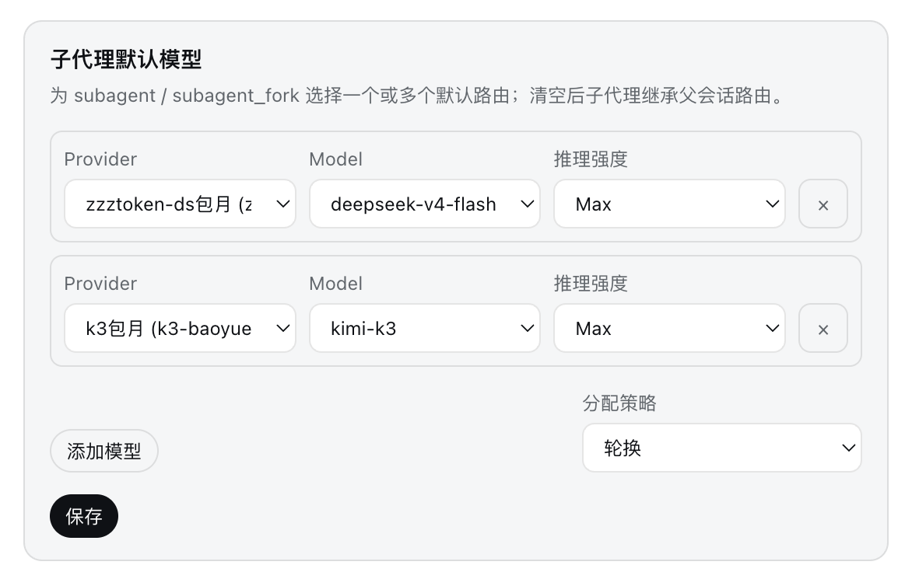
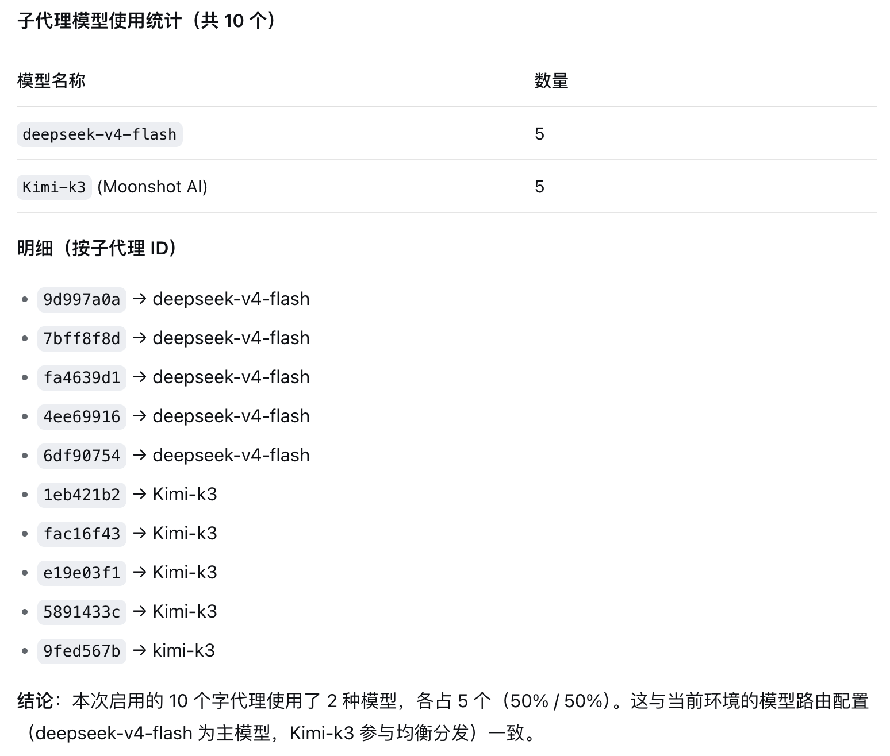

<p align="center">
  
</p>

<h1 align="center">dsh-subagent-default-model</h1>

<p align="center"><b>为 DeepSeek Harness 子代理选择默认模型，并支持多模型轮换。</b></p>

<p align="center">
  <a href="README.en.md">English</a> ·
  <a href="#安装">安装</a> ·
  <a href="#配置">配置</a> ·
  <a href="plugin/CHANGELOG.md">更新日志</a> ·
  <a href="https://github.com/dingminhua/dsh-subagent-default-model/issues">问题反馈</a>
</p>

<p align="center">
  <a href="https://www.npmjs.com/package/dsh-subagent-default-model"></a>
  <a href="https://www.npmjs.com/package/dsh-subagent-default-model"></a>
  <a href="https://github.com/dingminhua/dsh-subagent-default-model/actions/workflows/ci.yml"></a>
  <a href="LICENSE"></a>
  <a href="https://github.com/dingminhua/dsh-subagent-default-model/stargazers"></a>
  <a href="https://dshfind.com/plugins/dingminhua/dsh-subagent-default-model"></a>
</p>

一个独立的 [DeepSeek Harness (DSH)](https://github.com/deepseek-ai/deepseek-harness) bundle 插件。它只处理省略了 `agentOptions` 的子代理请求；显式指定的模型始终优先，DSH 核心包保持原样。

## 亮点

- **单模型默认路由**：所有未显式选模型的子代理使用同一条配置路由。
- **多模型调度**：通过 `round-robin` 或 `random` 在多个 provider/model 路由间分配。
- **连接失败自动切换**：子代理的模型请求遇到限流/配额/服务端错误时，自动在 `models` 列表内按队列或随机切换模型重试，主代理循环不受影响。
- **逐路由推理强度**：每个模型条目可独立配置 `reasoningEffort`。
- **完整覆盖派发入口**：同时包装 `start()` 与 `startContinuable()`，覆盖 `subagent`、`subagent_fork` 以及其他调用 `ctx.subagents` 的发起方。
- **设置热更新**：编辑设置后，下一次派发立即采用新配置。
- **干净卸载**：Cordis 销毁插件时恢复原始服务方法。
- **原生设置卡片**：可在 `设置 → 插件配置 → 子代理默认模型` 中完成配置。

## 工作原理

```text
显式请求 agentOptions
  → subagent-default-model 设置
  → 继承父会话路由
```

- 显式提供的 `agentOptions` 对象不会被修改。
- 非空 `models` 列表优先于兼容用的单 `model` 字段。
- 无效或不完整条目会被忽略；没有有效配置时回退到父会话路由。
- 多模型策略支持顺序轮换与独立随机选择。

## 效果预览

### 设置面板

配置一个或多个模型路由、分配策略以及逐路由推理强度。


### 分配验证

10 个子代理在 `deepseek-v4-flash` 与 `Kimi-k3` 之间以 round-robin 策略实现 5/5 分配。



## 安装

推荐使用 DSH 插件命令安装 npm 已发布版本：

```sh
dsh plugin --profile desktop add dsh-subagent-default-model
```

若使用其他 profile，请把 `desktop` 替换成对应名称。也可以直接通过 npm 安装：

```sh
npm install dsh-subagent-default-model
```

安装、更新或卸载 bundle 后，需要重启对应的 DSH 进程；仅修改设置不需要重启。

## 配置

可以在 Web 设置卡片中配置，也可以编辑 `~/.dsh/settings.yaml`。

### 固定一个默认模型

```yaml
subagent-default-model:
  provider: deepseek-official
  model: deepseek-v4-pro
```

### 多模型轮换

```yaml
subagent-default-model:
  provider: deepseek-official
  models:
    - deepseek-v4-pro
    - deepseek-v4-flash
    - provider: other-provider
      model: another-model
      reasoningEffort: high
  strategy: round-robin # round-robin | random
```

### 子代理连接失败自动切换（默认开启）

当子代理（subagent）自身的循环遇到连接类失败时，插件会自动在 `models` 列表内切换模型并按 `strategy` 规则重试——**仅对 subagent 生效，主代理循环不受影响**。

- **触发码**：命中以下任一错误码才切换——`RATE_LIMIT`、`QUOTA`、`SERVER`、`TIMEOUT`、`TRANSPORT`、`EMPTY_RESPONSE`。认证错误（如 `AUTH`）不会触发切换。
- **队列**：`round-robin` 策略下按列表顺序切到下一个模型。
- **随机**：`random` 策略下随机挑一个模型（不判断之前是否用过）。
- **需要 ≥ 2 个模型**：`models` 少于 2 项时本功能不生效。
- **耗尽即放行**：列表内全部模型轮试失败后放行真实错误，不做无限重试。
- **切换时丢弃继承的 `reasoningEffort`**：换到新 provider/model 后按默认推理强度请求，避免把主模型强度强加给不支持它的 provider。
- **Run 内粘性**：同一子代理 run 的后续 step 保持在切换后的模型上。
- **轨迹视图可见**：每次请求用的 provider/model 会显示在子代理的**轨迹视图**里——换模型（含 failover 切换）后自动多出一行「当前供应商/模型：`provider/model`」，方便确认重试/切换时用的到底是哪个模型。
- 该行为由 `failoverEnabled` 开关控制，默认 `true`：

```yaml
subagent-default-model:
  provider: deepseek-official
  models:
    - deepseek-v4-pro
    - deepseek-v4-flash
  failoverEnabled: true # 连接失败时按队列与策略切换模型
```

| 字段 | 类型 | 默认值 | 说明 |
| --- | --- | --- | --- |
| `provider` | string | — | 字符串模型条目共用的 provider。 |
| `model` | string | — | 单模型 ID，保留用于向后兼容。 |
| `models` | array | `[]` | 字符串或 `{ provider, model, reasoningEffort? }` 条目列表。 |
| `strategy` | string | `round-robin` | 多模型分配策略。 |
| `failoverEnabled` | boolean | `true` | 连接失败时在 `models` 列表内按队列与策略切换模型（仅 subagent）。 |
| `reasoningEffort` | string | — | 可选的逐路由推理强度。 |

## 市场收录与展示

插件已经包含可安装的 `dsh.bundle` manifest，并发布到 npm。社区市场通常从 [Awesome DSH Plugin](https://github.com/awesome-dsh-plugin/awesome-dsh-plugin) 注册表同步条目；仓库内的提交草稿位于 [`awesome-dsh-plugin-submission/dingminhua__dsh-subagent-default-model--plugin.yml`](awesome-dsh-plugin-submission/dingminhua__dsh-subagent-default-model--plugin.yml)。

市场卡片中的截图与 GitHub README 徽章是两套机制：

- **GitHub 徽章**由本 README 顶部的 Shields/dshfind 图片链接生成。
- **市场截图**由注册表 `data/screenshots.json` 控制；未配置时，市场会尝试从 README 提取图片。
- **市场图标/占位图**由具体市场的展示规则决定，并不是 npm `package.json` 的通用字段，也不是 README 徽章。

## 开发

```sh
npm --prefix plugin install
npm --prefix plugin test
```

根目录还提供两条聚焦回归命令：

```sh
node integration.mjs
node prove.mjs
```

完整开发说明见 [`DEVELOPMENT.md`](DEVELOPMENT.md)，发布步骤见 [`RELEASING.md`](RELEASING.md)。

## 卸载

```sh
dsh plugin --profile desktop remove dsh-subagent-default-model
```

重启 DSH 后 bundle 不再加载。`~/.dsh/settings.yaml` 中遗留的配置不会再生效，可按需手工删除。

## 许可证

本项目采用 [MIT 许可证](LICENSE) 开源发布，版权归属：**Copyright (c) 2026 LaoDing**。

MIT 许可证授予任何人免费处理本软件（包括使用、复制、修改、合并、发布、分发、再许可及出售副本）的权利，前提是所有副本或实质性部分均保留上述版权声明与本许可声明；软件按“原样”提供，不附带任何明示或暗示的担保。完整条款见 [LICENSE](LICENSE)。
